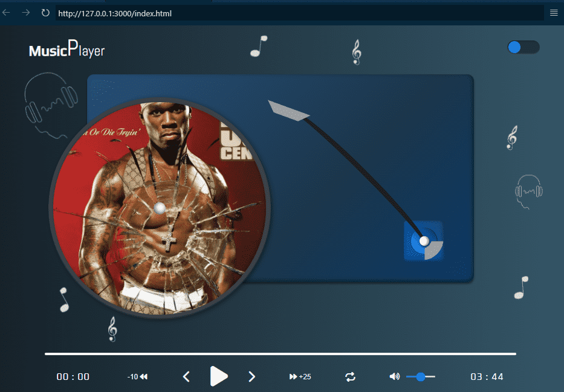

# 🎶 Custom Music Player

> **NOTE**: this project is a custom music application and has no relationship with any record label or music company. The purpose of this project is for entertainment only.
> The copyrights of the songs and images used in this project belong to their respective owners.

## Development Environment
----

__Technologies__

- [HTML5](https://developer.mozilla.org/en-US/docs/Web/HTML)
- [CSS3](https://developer.mozilla.org/en-US/docs/Web/CSS)
- [JavaScript](https://developer.mozilla.org/en-US/docs/Web/JavaScript)

__Souce code editor__

- [VSCode](https://code.visualstudio.com)

__Tool__

- [GIT](https://git-scm.com)

### Project Structure
----

```
└── 📁custom-music-player
    └── 📁assets
        └── 📁audio
        └── 📁figma
        └── 📁images
    └── 📁css
        └── main.css
    └── 📁hooks
        └── theme.js
    └── 📁js
        └── script.js
    └── 📁json
        └── index.json
    └── 📁modules
        └── custom_functions.js
        └── player.js
        └── template.js
    └── 📁utils
        └── debounce.js
        └── formatTime.js
    └── .gitignore
    └── favicon.ico
    └── index.html
    └── README.md
```

### ¿What is JSDoc?
----

[JSDoc](https://jsdoc.app) is a JavaScript documentation that uses tags to describe additional information about parameters and their return value, also a powerful tool for documenting JavaScript code.

Not only do they help other developers understand how to use your code, but they can also be used to generate automatic documentation.

Some of the advantages of using JSDoc tags are:

- Improves code readability.
- Makes the code easier to understand to other developers.
- Allows automatic documentation generation.
- Helps detect errors and inconsistencies in the code.
- Improve team collaboration.
<small style="font-size: .65rem">[META]</small>

Some of the most common JSDoc tags are: 

- @function
- @description
- @param
- @returns 

__Basic syntaxis:__

```js
  /**
   * 
   * Description of the function
   * @param { type } nameOfParam: description of parameter
  */

 function myFunction(nameOfParam){
  // code goes here
 }
```

__Explanation__

- __@function__: refers to a function and usually used in conjunction with the function name.
- __@description__: indicates detailed information about the functions, variables, classes or methods that are documented.
- __@param__: is a tag used in function and method documentation to be describe the parameters that are passed to functions.
- __{ type }__: specifies the data type of parameter, for example (string, number, object) etc.
- __@returns__ is a tag used to describe the return value of a function.
- __nameOfParam__: is the name of parameter.

__Example__

```js
  /**
   * 
   * @function sum
   * @description: calculate the sum of two numbers
   * @param { number } a: return the value of a
   * @param { number } b: return the value of b
   * @returns { number } return the sum of a and b
  */

  function sum(a, b){
    return a + b
  }
```

The following functions described below use JSDoc tags to discribe the purpose of each function and the parameters these function receive.

The JSDoc is not available in the examples below, but you can see them in the repository.

### Debounce
----

The ```debounce()``` function forces a function to wait a few times before running the execution and preventing from being called several times.

```js
  export function debounce(fun, wait, immediate){
    let timer;
    let later = () => {
      if(!immediate){
        func.apply(this, arguments)
      }
    }

    return (...args) => {
      const context = this;
      clearTimeout(timer);
      timer = setTimeout(later, wait);

      const callNow = immediate && !timer;
      if(callNow){
        func.apply(context, args)
      }
    }
  }
```

### Format Time
----

The ```formatTime``` function allows you to get the time from current format.

```js
const formatTime = (time) => {
  const hour = Math.floor(~~(time / 3600));
  const minutes = Math.floor(~~(time % 3600) / 60);
  const seconds = Math.floor(time % 60);

  let output = "";

  //.... 
}
```

More information about this function and how to use it, go to [formatTime function](https://github.com/lkopacz/egghead-react-a11y-audio-player) and follow the steps: 

1. Swtich to branch <i class="fa-solid fa-code-branch"></i> section
2. Choose the 09-mute-states branch <i class="fa-solid fa-code-branch"></i>
3. Choose the code <i class="fa-solid fa-code"></i> section
4. Go to folder <i class="fa-regular fa-folder"></i> (__src__)
5. Next, go to foler <i class="fa-regular fa-folder"></i> (__Components__)
6. Choose the file <i class="fa-regular fa-file"></i> (__audio-player.js__)

Owner: [Lindsey Kopacz](https://github.com/lkopacz).

### Switch to Custom Music Player
----

__Usage__

To use this music player, you must open your development environment, in this case VSCode and access the index.html file, once in the file, press the "Show preview" button, which is located at the top right of the index.html, this will make the project open in a new window, to the right side of your index.html file, once there you can use the player.

__Characteristics__

It is a music player, with an attractive user interface, you can also change the theme from light to dark with the button on the top right.
Additionally, the player contains the following functionalities:

- Play the current song.
- Go back or forward a song for "n" seconds.
- Change music by pressing the forward and/or back buttons.
- Choose a song at random.
- Increase or decrease the volume.
- See the duration time and/or elapsed time.

__Requirements__

- Have a development environment.
- It is not necessary to have an internet connection to use the player, but the source type and icons may be changed, since external links are used.

### (UI/UX) Design
----

__¿What is UI/UX design?__

- UI (User Interface): refers to the visual appearance of an application or website, including elements such as buttons, menus, colors and fonts.

- UX (User Experience): focuses on the user's experience when interacting with an application, from ease of use to overall satisfaction.
<small style="font-size: .65rem">[GEMINI]</small>

__Visual Appearance__

- __Dark mode__



- __Light mode__


### Music Player Operation
----

__Screeshots__

- __Pause__


- __Play__


### License
-----

This project is distributed under the __MIT__ license. See the [LICENSE](./LICENSE) for more information

<p>&copy; 2024, Damian Ponce</p>

### Translation
----

Spanish version:

- [es-Español](./es-ES/README-ES.md)