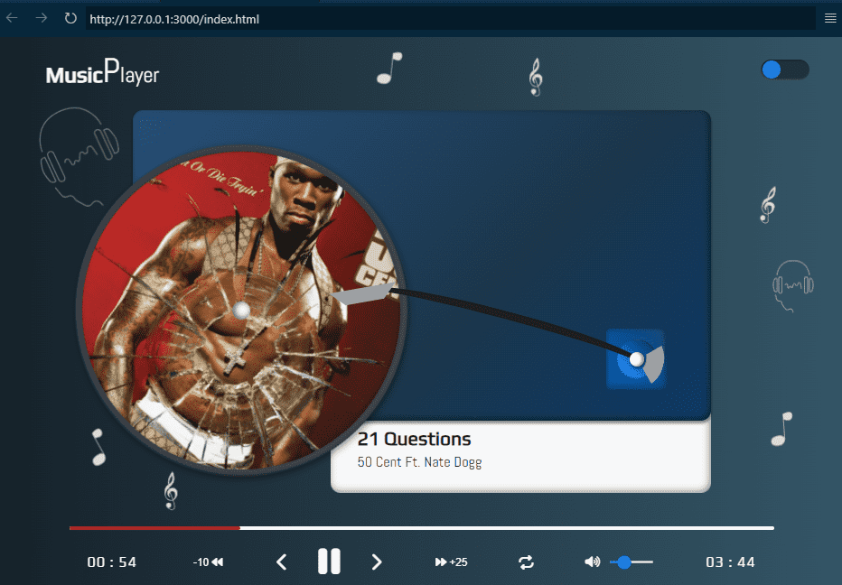

# 🎶 Custom Music Player

> **NOTE**: this project is a custom music application and has no relationship with any record label or music company. The purpose of this project is for entertainment only.
> The copyrights of the songs and images used in this project belong to their respective owners.

## Development Environment
----

__Technologies__

- [HTML5](https://developer.mozilla.org/en-US/docs/Web/HTML)
- [CSS3](https://developer.mozilla.org/en-US/docs/Web/CSS)
- [JavaScript](https://developer.mozilla.org/en-US/docs/Web/JavaScript)

__Souce code editor__

- [VSCode](https://code.visualstudio.com)

__Tool__

- [GIT](https://git-scm.com)

### Project Structure
----

```
└── 📁custom-music-player
    └── 📁assets
        └── 📁audio
        └── 📁figma
        └── 📁images
    └── 📁css
        └── main.css
    └── 📁hooks
        └── theme.js
    └── 📁js
        └── script.js
    └── 📁json
        └── index.json
    └── 📁modules
        └── custom_functions.js
        └── player.js
        └── template.js
    └── 📁utils
        └── debounce.js
        └── formatTime.js
    └── .gitignore
    └── favicon.ico
    └── index.html
    └── README.md
```

### ¿What is JSDoc?
----

[JSDoc](https://jsdoc.app) is a JavaScript documentation that uses tags to describe additional information about parameters and their return value, also a powerful tool for documenting JavaScript code.

Not only do they help other developers understand how to use your code, but they can also be used to generate automatic documentation.

Some of the advantages of using JSDoc tags are:

- Improves code readability.
- Makes the code easier to understand to other developers.
- Allows automatic documentation generation.
- Helps detect errors and inconsistencies in the code.
- Improve team collaboration.
<small style="font-size: .65rem">[META]</small>

Some of the most common JSDoc tags are: 

- @function
- @description
- @param
- @returns 

__Basic syntaxis:__

```js
  /**
   * 
   * Description of the function
   * @param { type } nameOfParam: description of parameter
  */

 function myFunction(nameOfParam){
  // code goes here
 }
```

__Explanation__

- __@function__: refers to a function and usually used in conjunction with the function name.
- __@description__: indicates detailed information about the functions, variables, classes or methods that are documented.
- __@param__: is a tag used in function and method documentation to be describe the parameters that are passed to functions.
- __{ type }__: specifies the data type of parameter, for example (string, number, object) etc.
- __@returns__ is a tag used to describe the return value of a function.
- __nameOfParam__: is the name of parameter.

__Example__

```js
  /**
   * 
   * @function sum
   * @description: calculate the sum of two numbers
   * @param { number } a: return the value of a
   * @param { number } b: return the value of b
   * @returns { number } return the sum of a and b
  */

  function sum(a, b){
    return a + b
  }
```

The following functions described below use JSDoc tags to discribe the purpose of each function and the parameters these function receive.

The JSDoc is not available in the examples below, but you can see them in the repository.

### Debounce
----

The ```debounce()``` function forces a function to wait a few times before running the execution and preventing from being called several times.

```js
  export function debounce(fun, wait, immediate){
    let timer;
    let later = () => {
      if(!immediate){
        func.apply(this, arguments)
      }
    }

    return (...args) => {
      const context = this;
      clearTimeout(timer);
      timer = setTimeout(later, wait);

      const callNow = immediate && !timer;
      if(callNow){
        func.apply(context, args)
      }
    }
  }
```

### Format Time
----

The ```formatTime``` function allows you to get the time from current format.

```js
const formatTime = (time) => {
  const hour = Math.floor(~~(time / 3600));
  const minutes = Math.floor(~~(time % 3600) / 60);
  const seconds = Math.floor(time % 60);

  let output = "";

  //.... 
}
```

More information about this function and how to use it, go to [formatTime function](https://github.com/lkopacz/egghead-react-a11y-audio-player) and follow the steps: 

1. Swtich to branch <i class="fa-solid fa-code-branch"></i> section
2. Choose the 09-mute-states branch <i class="fa-solid fa-code-branch"></i>
3. Choose the code <i class="fa-solid fa-code"></i> section
4. Go to folder <i class="fa-regular fa-folder"></i> (__src__)
5. Next, go to foler <i class="fa-regular fa-folder"></i> (__Components__)
6. Choose the file <i class="fa-regular fa-file"></i> (__audio-player.js__)

Owner: [Lindsey Kopacz](https://github.com/lkopacz).

### Switch to Custom Music Player
----

__Usage__

To use this music player, you must open your development environment, in this case VSCode and access the index.html file, once in the file, press the "Show preview" button, which is located at the top right of the index.html, this will make the project open in a new window, to the right side of your index.html file, once there you can use the player.

__Characteristics__

It is a music player, with an attractive user interface, you can also change the theme from light to dark with the button on the top right.
Additionally, the player contains the following functionalities:

- Play the current song.
- Go back or forward a song for "n" seconds.
- Change music by pressing the forward and/or back buttons.
- Choose a song at random.
- Increase or decrease the volume.
- See the duration time and/or elapsed time.

__Requirements__

- Have a development environment.
- It is not necessary to have an internet connection to use the player, but the source type and icons may be changed, since external links are used.

### (UI/UX) Design
----

__¿What is UI/UX design?__

- UI (User Interface): refers to the visual appearance of an application or website, including elements such as buttons, menus, colors and fonts.

- UX (User Experience): focuses on the user's experience when interacting with an application, from ease of use to overall satisfaction.
<small style="font-size: .65rem">[GEMINI]</small>

__Visual Appearance__

- __Dark mode__


- __Light mode__


### Music Player Operation
----

__Screeshots__

- __Pause__


- __Play__



###Code Fragment Analysis
----

__fetchData__

Within the _fetchData_ function, all the logic that will be used to extract the data from the playlist, which is stored in the _JSON_ file, is stored and thus, load the first song in said list.

__Operation:__

1. __Get data:__ the _fetch_ function is used to request the JSON file that contains the song information.

2. __Parse data:__ converts the JSON response into a JavaScript object, which is stored in the _playlist_ variable.

3. __Loading songs:__ the _loadCurrentSong_ function is responsible for loading or obtaining the first song in the playlist.

**Before:**

```js
const fetchData = async () => {
    const requestURL = '../json/index.json';
    try {
      const response = await fetch(requestURL);
      const json = await response.json();
      playlist = json
      loadCurrentSong(playlist[index])
    } catch(error) {
      log(`Failure to load data: ${error}`)
    }
  }

  fetchData();
```

**Now:**

```js
const fetchData = async (URL) => {
    try {
      const response = await fetch(URL);
      if(!response.ok) throw new Error('Failure to load data');

      const data = await response.json();
      playlist = data;
      loadCurrentSong(playlist, index)
    } catch(error) {
      log(`${error.message}`)
    }
  }

const requestURL = '../json/index.json';
fetchData(requestURL)
```

__Explanation:__

1. __Declaration of the ```fetchData``` function:__

    - ```async```: Indicates that the function is asynchronous, meaning that it can perform operations that take time without blocking the execution of the rest of the code (such as waiting for a file to be completely loaded).

    - the variable ```const requestURL = "../json/index.json"```, defines the _URL_ or _Path_ of the _JSON_ file, which contains the playlist information.

2. __Block _try...catch_:__

    - ```try```: attempts to execute the code inside the block.
      - ```fetch(URL)```: makes an _HTTP_ request or request to obtain the information from the JSON file.

      - - ```if(!response.ok) throw new Error('Failure to load data')```: if the request for the information of the data found in the file is not satisfactory, it will throw an error informing that something has gone wrong with the data loading.

      - ```response.json()```: allows you to convert the response (which is a RESPONSE object) to a JavaScript object.

      - ```playlist```: the variable _json_ is assigned, which contains the response that is converted to a JavaScript object.

      - ```loadCurrentSong(playlist, index)```: loads the first song in the playlist.
    
    - ```catch```: If an error occurs during the execution of the ```try``` block, this block will be executed.

      - ```log(`${error.message}`)```: prints an error message to the console, indicating that there was a problem loading the data.

3. __Call to the ```fetchData``` function:__
    - _fetchData(requestURL):_ invokes the function to start the process of obtaining and loading the data.

__loadCurrentSong__

In this JavaScript code fragment, a function called ```loadCurrentSong``` is defined, which is responsible for loading the information of a specific song from a music player, based on the data provided in an object.

__Operation:__

1. __Object destructuring:__ extracts the properties of the input object, for ease of use.

2. __Interface update:__ modifies the _HTML_ elements to display the song information.

3. __Audio load:__ establishes the source of the audio element and loads it.

4. __Error Handling:__ a _try...catch_ block is used to catch errors that may occur during the data loading process.

**Before:**

```js
const loadCurrentSong = (current) => {
    const { artist, song, title, poster } = current;

    try {
      cover.style.backgroundImage = `url(${poster})`;
      artistName.innerText = `${artist}`;
      songName.innerText = `${title}`;

      audio.src = `${song}`;
      audio.load();
    } catch(error) {
      log(`Failure to parse the data: ${error}`)
    }
  }
```

**Now:**

```js
const loadCurrentSong = (data, index) => {
  const source = data.playlist[index];
  const { artist, song, title, poster } = source;

  try {
    cover.style.backgroundImage = `url(${poster})`;
    artistName.innerText = `${artist}`;
    songName.innerText = `${title}`;

    audio.src = `${song}`;
    audio.load();
  } catch(error) {
    log(`Failure to parse the data: ${error}`)
  }
}
```

__Explanation:__

1. ```const loadCurrentSong = (data, index) => {```:
    - a constant function called _loaCurrentSong_ is defined, which takes two parameters ```data``` and ```index``` , the first parameter is an object that contains the information of a song, such as (artist, song , title, poster), and the second parameter is the index that will be passed to the object to indicate that the song will start at index 0.

2. ```const source = data.playlist[index]```: 
    - starts the information found in the JSON file, at the first index.

2. ```const { artist, song, title, poster } = source```:
    - a destructuring of the _current_ object is performed to extract the properties and assign them to the variables. This makes it easier to access these values ​​within the function.

3. ```try```: 
    - a _try_ block is started to handle possible errors that may occur during code execution.

4. ```cover.style.backgroundImage = url(`${poster}`)```:
    - set the element's backgroundImage property to show the song cover.
    The image _URL_ is constructed using the template literal and the _poster_ property of the _current_ object.

5. ```artistName.innerText = `${artist}` ```:
    - the name of the artist is set within the _artistName_ element, which is obtained from the _artist_ property of the _current_ object.

6. ```songName.innerText = `${title}` ```:
    - the song title is set within the _songName_ element, which is obtained from the _title_ property of the _current_ object.

7. ```audio.src = `${song}` ```:
    - the source of the audio element is set within the _audio_ element, with the URL of the song that is obtained from the _song_ property of the _current_ object.

8. ```audio.load()```:
    - loading of the audio file begins.

9. ```catch(error)```:
    - if any error occurs during execution within the _try_ block, the _catch_ block is executed.

10. ```log(`Failure to load data: ${error}`)```:
    - an error message is printed to the console, indicating that there was a problem processing the data.

__playSong__

When the user clicks or presses the _play_ button, the _playSong_ function is called, to allow the player to start playing the selected song.

__Operation:__

1. __HTML Elements:__ adds classes to various elements, to indicate that playback has started.

2. __Play button icon change:__ the icon changes to "pause" (<i class="fa-solid fa-pause"></i>), to indicate that at any time, the user can press said button, to pause the current song.

3. __Start the player:__ when you press the _play_ button, the _play()_ method that is associated with the audio element is activated and the song begins to play.

```js
const playSong = () => {
    outerPlate.classList.add('play');
    tonearm.classList.add('active');
    featureContainer.classList.add('visible');

    playBtn.innerHTML = pause;
    audio.play()
  }
```

__Explanation:__

1. ```outerPlate```, ```tonearm```, ```featureContainer```: 
    - are _HTML_ elements, which receive their respective classes to make the user interface change, depending on whether playback is activated.
      - ```outerPlate```: when the play button is pressed, the circle or disc in which the artist's cover or cover is displayed rotates clockwise.
      - ```tonearm```: is the arm found at the bottom right of the player, which rotates about 15 degrees, at the same time as the _outerPlate_ element, when the play button is pressed.
      - ```featureContainer```: this element is displayed down when the play button is pressed.
    
2. ```playBtn.innerHTML = pause```: the _playBtn_ element is responsible for playing the current song and changes its icon to _pause_, to indicate to the user that the current song can be paused or stopped.
    - ```pause```: it is an object that works as a variable, since it is stored in the _icons_ object, like this: ```const icons = {pause: '<i class="fa-solid fa- pause"></i>'}```.

3. ```audio.play()```: code responsible for making an audio or a song start playing.
    - ```audio```: _HTML_ element.
    - ```play()```: method responsible for starting a playback.

__pauseSong__

When the user clicks or presses the _pause_ button, the _pauseSong_ function is called, to allow the player to stop playing the selected song.

__Operation:__

1. __HTML Elements:__ removes classes from various elements, to indicate that playback has been paused.

2. __Play button icon change:__ the icon changes to "play" (<i class="fa-solid fa-play"></i>), to indicate that at any time, the user can press said button, to play the current song.

3. __Stop the player:__ when you press the _pause_ button, the _pause()_ method that is associated with the audio element is activated and the playback of the song is paused.

```js
const pauseSong = () => {
    outerPlate.classList.remove('play');
    tonearm.classList.remove('active');
    featureContainer.classList.remove('visible');

    pauseBtn.innerHTML = play;
    audio.play()
  }
```

__Explanation:__

1. ```outerPlate```, ```tonearm```, ```featureContainer```: 
    - are _HTML_ elements, which receive their respective classes to make the user interface change, depending on whether the playback is paused or stopped.
      - ```outerPlate```: when the play button is pressed and its state is paused, the circle or disc in which the artist's cover or cover is displayed will stop, to indicate that its playback has been detained.
      - ```tonearm```: is the arm located at the bottom right of the player, which will return to its initial position when the pause button is pressed.
      - ```featureContainer```: this element is displayed at the top when the pause button is pressed, indicating that the playback of a song has stopped.

2. ```pauseBtn.innerHTML = play```: the _pauseBtn_ element is responsible for pausing the playback of the current song and changes its icon to _play_, to indicate to the user that the current song can start playing.
    - ```play```: it is an object that works as a variable, since it is stored in the _icons_ object, like this: ```const icons = {play: '<i class="fa-solid fa- ´play"></i>'}```.

3. ```audio.pause()```: code responsible for stopping the playback of an audio or a song.
    - ```audio```: _HTML_ element.
    - ```pause()```: method responsible for pausing a playback.

__handlePlaySong__

This function is responsible for changing the state of the play button, from _play_ to _pause_, when the user has clicked on the play button, acting as a switch.

Every time the _handlePlaySong_ function is called, it checks the current playing state and performs the opposite action.

__Operation:__

1. __If the music is not playing:__ start playback and change the state of the _playing_ variable to __true__.

2. __If music is playing:__ pause the music and change the state of the variable _playing_ to __false__.

__Additional considerations:__

1. __Variable ```playing```:__ this variable acts as an indicator of the current state of playback. Its value changes each time the ```handlePlaySong``` function is called.

2. __```playSong()``` and ```pauseSong()``` functions:__ these functions contain the logic to start and pause music playback. 

```js
const handlePlaySong = () => {
    if(!playing) {
      playing = true;
      playSong()
    }else {
      playing = false;
      pauseSong()
    }
  }
```

__Explanation:__

1. - ```handlePlaySong```: This function works as a switch, to allow the user to change the state of the play button. It is created using an arrow function ```() => {}``` that is assigned to a constant ```const``` to define the body containing the logic.

2. - ```if(!playing){}```: an _if_ condition is used to determine if the _playing_ variable is false, which will allow the code to be executed within the braces ```{}```.

3. - ```playing = true```: the _playing_ variable is set to true, indicating that it is now active and music playback can start.

4. - ```playSong()```: function responsible for starting playback.

5. - ```else{}```: if the _if_ condition is not met, the code that is in this block is executed.

6. - ```playing = false```: the _playing_ variable is set to false, indicating that said variable is inactive and stopping playback.

7. - ```pauseSong()```: function responsible for pausing music.

__handlePrevSong__

This function is responsible for playing the previous song every time the user presses the "back" button (<i class="fa-solid fa-chevron-left"></i>), in addition to being essential in sequential or random music playback.

__Operation:__

1. __Decrements the index of a song:__ the index value in the playlist is decremented.

2. __List handling:__ if the list reaches the beginning, it returns to the end of said list.

3. __Restart playback:__ the audio playback position and progress bar are reset.

4. __Load new song:__ the previous song is loaded into the player.

5. __Start playback:__ the song starts loading.

6. __Random mode handling:__ If in random mode, a new song is selected randomly instead of the previous one.

__Additional considerations:__

1. __Global variables:__ the variables ```index```, ```playlist```, ```randomMode```, ```audio```, ```progress```, are accessible within the scope of this function.

2. __Random Mode:__ the ```randomMode``` variable is responsible for controlling whether playback is done randomly or sequentially.

**Before:**

```js
const handlePrevSong = () => {
    index--;

    if(!randomMode) {
      randomMode = false;

      if(index < 0) index = playlist.length - 1;
      audio.currentTime = 0;
      progress.style.width = 0;
      
      loadCurrentSong(playlist[index]);
      playSong()
    }else {
      randomMode = true;
      chooseRandomSong()
    }

  }
```

**Now:**

```js
const handlePrevSong = () => {
  index--;

  try {
    if(!randomMode) {
      randomMode = false;

      if(index < 0) index = playlist.length - 1;
      audio.currentTime = 0;
      progress.style.width = 0;
      
      loadCurrentSong(playlist, index);
      playSong();
    }else {
      randomMode = true;
      chooseRandomSong()
    }
  } catch (error) {
    log(`Error to play the previous song: ${error.message}`)
  }
}
```

__Explanation:__

1. __```handlePrevSong```:__ this function is used to handle the action of moving to the previous song in the playlist.

2. __```index--```:__ in this case, the variable _index_ decrements the value by 1, to track the current position of the song.

3. __```try/catch```__: block to handle possible errors in the execution of the code, and throw an error through the console, if the code that is in the _try_ block is not executed.

3. __```if(!randomMode)```:__ if the variable _randomMode_ inside the parentheses ```()``` in the _if_ statement is false, the code inside the braces ` is executed ``{}```.

4. __```randomMode = false```:__ if not in random mode, this variable is set to false.

5. __```if(index < 0) index = playlist.length - 1```:__ if the index becomes negative, sets the index to the last item in the playlist.

6. __```audio.currentTime = 0```:__ the audio playback is restarted at its initial position.

7. __```loadCurrentSong(playlist, index)```:__ the _loadCurrentSong_ function is called to load the new song (the previous one in the list) from the player.

8. __```else```:__ if the condition _if_ is not met, the code that is in this block is executed.

9. __```randomMode = true```:__ the random mode is kept active.

10. __```chooseRandomSong()```:__ the _chooseRandomSong_ function is called to select a random song from the playlist.

__handleNextSong__

Like the previous function, this function is responsible for the sequential or random management of music, with the difference that it advances to the next song, each time the user presses the "forward" button (<i class="fa-solid fa -chevron-right"></i>).

__Operation:__

1. __Increment the index of a song:__ the index value in the playlist is incremented.

2. __List management:__ if the list reaches the end, it returns to the beginning of said list.

3. __Restart playback:__ the audio playback position and progress bar are reset.

4. __Load new song:__ the next song is loaded into the player.

5. __Start playback:__ the song starts loading.

6. __Random mode handling:__ If in random mode, a new song is selected randomly instead of the next one.

__Additional considerations:__

1. __Global variables:__ the variables ```index```, ```playlist```, ```randomMode```, ```audio```, ```progress```, are accessible within the scope of this function.

2. __Random Mode:__ the ```randomMode``` variable is responsible for controlling whether playback is done randomly or sequentially.

**Before:**

```js
const handleNextSong = () => {
  index++;

  if(!randomMode){
    randomMode = false;

    if(index > playlist.length - 1) index = 0;
    audio.currentTime = 0;
    progress.style.width = 0;

    loadCurrentSong(playlist[index]);
    playSong()
  }else{
    randomMode = true;
    chooseRandomSong()
  }
}
```

**Now:**

```js
const handleNextSong = () => {
  index++;

  try {
    if(!randomMode) {
      randomMode = false;

      if(index > playlist.length - 1) index = 0;
      audio.currentTime = 0;
      progress.style.width = 0;

      loadCurrentSong(playlist, index);
      playSong();
    }else {
      randomMode = true;
      chooseRandomSong()
    }
  } catch (error) {
    log(`Error to play the next song: ${error.message}`)
  }
}
```

__Explanation:__

1. __```handleNextSong```:__ this function is used to handle the action of moving to the next song in the playlist.

2. __```index--```:__ in this case, the _index_ variable increments the value by 1, to track the current position of the song.

3. __```try/catch```__: block to handle possible errors in the execution of the code, and throw an error through the console, if the code that is in the _try_ block is not executed.

3. __```if(!randomMode)```:__ if the variable _randomMode_ inside the parentheses ```()``` in the _if_ statement is false, the code inside the braces ` is executed ``{}```.

4. __```randomMode = false```:__ if not in random mode, this variable is set to false.

5. __```if(index > playlist.length - 1) index = 0```:__ if index becomes positive, sets the index to the start of the playlist item.

6. __```audio.currentTime = 0```:__ the audio playback is restarted at its initial position.

7. __```loadCurrentSong(playlist, index)```:__ the _loadCurrentSong_ function is called to load the new song (the next one in the list) from the player.

8. __```else```:__ if the condition _if_ is not met, the code that is in this block is executed.

9. __```randomMode = true```:__ the random mode is kept active.

10. __```chooseRandomSong()```:__ the _chooseRandomSong_ function is called to select a random song from the playlist.

### License
-----

This project is distributed under the __MIT__ license. See the [LICENSE](./LICENSE) for more information

<p>&copy; 2024, Damian Ponce</p>

### Translation
----

Spanish version:

- [es-Español](./es-ES/README-ES.md)