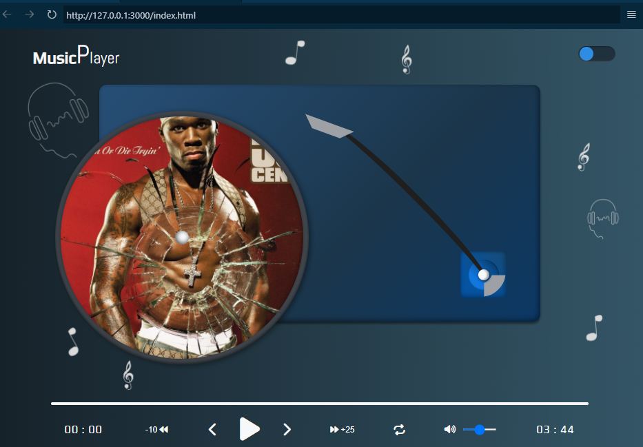
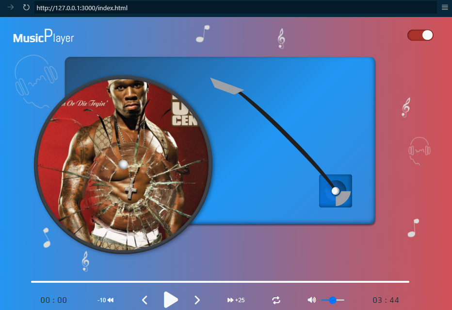
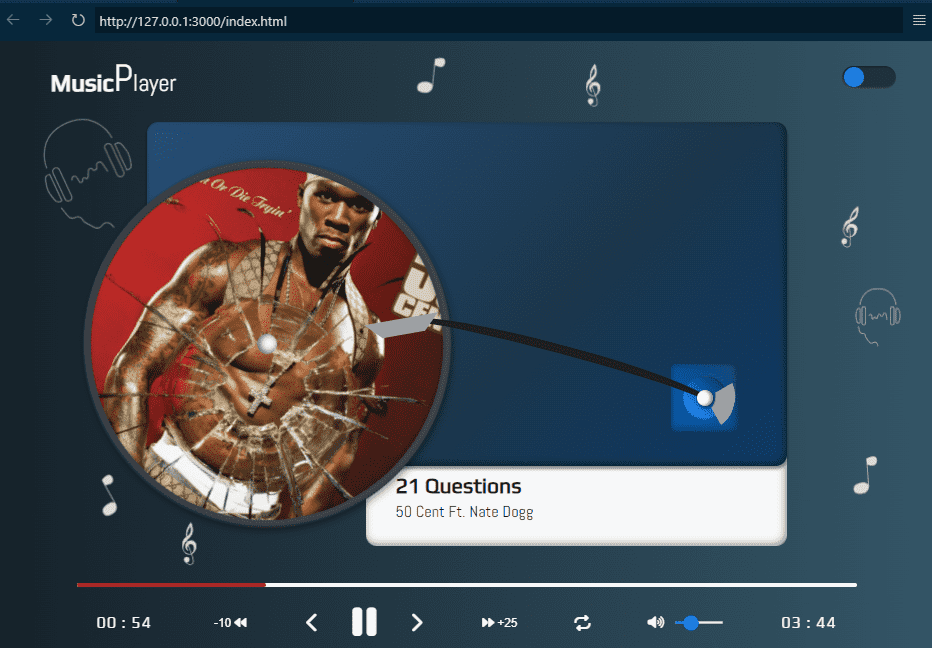

# 🎶 Reproductor de Música Personalizado

> **NOTA**: este proyecto es una aplicación de música personalizada y no tiene relación con ningún sello discográfico o compañía musical. El propósito de este proyecto es únicamente para entretenimiento.
> Los derechos de autor de las canciones e imágenes utilizadas en este proyecto pertenecen a sus respectivos dueños.

## Entorno de Desarrollo
----

__Tecnologías__

- [HTML5](https://developer.mozilla.org/en-US/docs/Web/HTML)
- [CSS3](https://developer.mozilla.org/en-US/docs/Web/CSS)
- [JavaScript](https://developer.mozilla.org/en-US/docs/Web/JavaScript)

__Editor de código fuente__

- [VSCode](https://code.visualstudio.com)

__Herramienta__

- [GIT](https://git-scm.com)

### Estructura del Proyecto
----

```
└── 📁custom-music-player
    └── 📁assets
        └── 📁audio
        └── 📁figma
        └── 📁images
    └── 📁css
        └── main.css
    └── 📁hooks
        └── theme.js
    └── 📁js
        └── script.js
    └── 📁json
        └── index.json
    └── 📁modules
        └── custom_functions.js
        └── player.js
        └── template.js
    └── 📁utils
        └── debounce.js
        └── formatTime.js
    └── .gitignore
    └── favicon.ico
    └── index.html
    └── README.md
```

### ¿Qué es JSDoc?
----

[JSDoc](https://jsdoc.app) es una documentación de JavaScript que utiliza etiquetas para describir información adicional sobre los parámetros y su valor de retorno, y también es una poderosa herramienta para documentar el código JavaScript.

No solo ayudan a otros desarrolladores a comprender cómo usar su código, sino que también pueden usarse para generar documentación automática.

Algunas de las ventajas de utilizar etiquetas JSDoc son:

- Mejora la legibilidad del código.
- Hace que el código sea más fácil de entender para otros desarrolladores.
- Permite la generación automática de documentación.
- Ayuda a detectar errores e inconsistencias en el código.
- Mejorar la colaboración en equipo.
<small style="font-size: .65rem">[META]</small>

Algunas de las etiquetas JSDoc más comunes son: 

- @function
- @description 
- @param
- @returns

__Sintaxis básica:__

```js
  /**
   * 
   * Descripción de la función
   * @param { tipo } nameOfParam: descripción del parámetro
  */

 function miFuncion(nombreDeParam){
  // el código va aquí
 }
```

__Explicación__

- __@function__: se refiere a una función y generalmente se usa junto con el nombre de la función.
- __@description__: indica información detallada sobre las funciones, variables, clases o métodos que están documentados.
- __@param__: es una etiqueta utilizada en la documentación de funciones y métodos para describir los parámetros que se pasan a las funciones.
- __{ tipo }__: especifica el tipo de datos del parámetro, por ejemplo (cadena, número, objeto), etc.
- __@returns__: es una etiqueta utilizada para describir el valor de retorno de una función.
- __nameOfParam__: es el nombre del parámetro.

__Ejemplo__

```js
  /**
   * 
   * @function suma
   * @description: calcula la suma de dos números
   * @param { número } a: devuelve el valor de a
   * @param { número } b: devuelve el valor de b
   * @returns { número } devuelve la suma de a y b
  */

  function suma(a, b){
    return a + b
  }
```

Las siguientes funciones que se describen a continuación utilizan etiquetas JSDoc para describir el propósito de cada función y los parámetros que reciben.

El JSDoc no está disponible en los ejemplos siguientes, pero puede verlos en el repositorio.

### Debounce
----

La función ```debounce()``` fuerza a una función a esperar unas cuantas veces antes de ser ejecutada y evitar que sea llamada varias veces.

```js
  export function debounce(fun, wait, immediate){
    let timer;
    let later = () => {
      if(!immediate){
        func.apply(this, arguments)
      }
    }

    return (...args) => {
      const context = this;
      clearTimeout(timer);
      timer = setTimeout(later, wait);

      const callNow = immediate && !timer;
      if(callNow){
        func.apply(context, args)
      }
    }
  }
```

### Format Time
----

La función ```formatTime``` le permite obtener la hora del formato actual.

```js
const formatTime = (time) => {
  const hour = Math.floor(~~(time / 3600));
  const minutes = Math.floor(~~(time % 3600) / 60);
  const seconds = Math.floor(time % 60);

  let output = "";

  //.... 
}
```

Más información sobre esta función y cómo usarla, vaya a [función formatTime](https://github.com/lkopacz/egghead-react-a11y-audio-player) y siga los pasos:

1. Cambiar de rama <i class="fa-solid fa-code-branch"></i> (branch)
2. Elige la rama <i class="fa-solid fa-code-branch"></i> 09-mute-states
3. Elige la sección "código" <i class="fa-solid fa-code"></i>
4. Ir a la carpeta <i class="fa-regular fa-folder"></i> (__src__)
5. A continuación, vaya a la carpeta <i class="fa-regular fa-folder"></i> (__Components__)
6. Elija el archivo <i class="fa-regular fa-file"></i> (__audio-player.js__)

Propietario: [Lindsey Kopacz](https://github.com/lkopacz).

### Cambiar a Reproductor de Música Personalizado
----

__Uso__

Para utilizar este reproductor de música, debes abrir tu entorno de desarrollo, en este caso VSCode y acceder al archivo index.html, una vez en el archivo, presiona el botón "Mostrar vista previa", que se encuentra en la parte superior derecha del index.html, esto hará que el proyecto se abra en una nueva ventana, al lado derecho de su archivo index.html, una vez allí podrá usar el reproductor.

__Características__

Es un reproductor de música, con una interfaz de usuario atractiva, también puedes cambiar el tema de claro a oscuro con el botón en la parte superior derecha.
Además, el reproductor contiene las siguientes funcionalidades:

- Reproducir la canción actual.
- Retroceder o avanzar una canción durante "n" segundos.
- Cambia de música pulsando los botones de avance y/o retroceso.
- Elige una canción al azar.
- Subir o bajar el volumen.
- Ver el tiempo de duración y/o tiempo transcurrido.

__Requisitos__

- Disponer de un entorno de desarrollo.
- No es necesario tener conexión a internet para utilizar el reproductor, pero es posible que se cambie el tipo de fuente e iconos, ya que se utilizan enlaces externos.

### Diseño (UI/UX)
----

__¿Qué es el diseño UI/UX?__

- UI (Interaz de Usuario): se refiere a la apariencia visual de una aplicación o sitio web, incluyendo elementos como botones, menús, colores y fuentes.

- UX (Experiencia de Usuario): se centra en la experiencia de usuario al interactuar con una aplicación, desde la facilidad de uso hasta la satisfación general.
<small style="font-size: .65rem">[GEMINI]</small>

__Apariencia visual__

- __Mode oscuro__



- __Modo claro__



### Funcionamiento del Reproductor de Música
----

__Capturas de pantalla__

- __Pausa__


- __Reproducir__



### Análisis de Fragmentos de Código
----

__fetchData__

Dentro de la función _fetchData_, se encuentra almacenda toda la lógica que utilizará para extraer los datos de la lista de reproducción, que se encuentran almacenados en el archivo _JSON_, y así, cargar la primera canción de dicha lista.

__Funcionamiento:__

1. __Obtener datos:__ se utiliza la función _fetch_, para solicitar el archivo JSON que contiene la información de las canciones.

2. __Parsear datos:__ convierte la respuesta JSON en un objeto JavaScript, que se almacena en la variable _playlist_.

3. __Carga de canciones:__ la función _loadCurrentSong_, se encarga de cargar u obtener la primera canción de la lista de reproducción.

```js
const fetchData = async () => {
    const requestURL = '../json/index.json';
    try {
      const response = await fetch(requestURL);
      const json = await response.json();
      playlist = json
      loadCurrentSong(playlist[index])
    } catch(error) {
      log(`Failure to load data: ${error}`)
    }
  }

  fetchData();
```

__Explicación:__

1. __Declaración de la función ```fetchData```:__

    - ```async```: indica que la función es asincrona, lo que significa que puede realizar operaciones que toman tiempo sin bloquear la ejecución del resto del código (como esperar a que un archivo se haya cargado por completo).

    - la variable ```const requestURL = "../json/index.json"```, define la _URL_ o _Ruta_ del archivo _JSON_, que contiene la información de la lista de reproducción.

2. __Bloque _try...catch_:__

    - ```try```: intenta ejecutar el código dentro del bloque.
      - ```fetch(requestURL)```: realiza una solicitud o petición _HTTP_ para obtener la información del archivo JSON.

      - ```response.json()```: permite convertir la respuesta (que es un objecto RESPONSE) a un objeto JavaScript.

      - ```playlist```: se le asigna la variable _json_, la cual contiene la respuesta que es convertida a un objeto JavaScript.

      - ```loadCurrentSong(playlist[index])```: carga la primera canción de la lista de reproducción.
    
    - ```catch```: si ocurre un error durante la ejecución del bloque ```try```, se ejecutará este bloque.

      - ```log(`Failure to load data: ${error}`)```: imprime un mensaje de error en consola, indicando que hubo un problema al cargar los datos.

3. __Llamada a la función ```fetchData```:__
    - _fetchData():_ invoca la función para iniciar el proceso de obtener y cargar los datos.

__loadCurrentSong__

En este fragmento de código JavaScript, se define una función llamada ```loadCurrentSong```, la cual es la encargada de cargar la información de una canción específica de un reproductor de música, basandose en los datos proporcionados en un objeto.

__Funcionamiento:__

1. __Desestructuración del objeto:__ extrae las propiedades del objeto de entrada, para facilitar su uso.

2. __Actualización de interfaz:__ modifica los elementos _HTML_, para mostrar la información de la canción.

3. __Carga de audio:__ establece la fuente del elemento de audio y carga de éste mismo.

4. __Manejo de errores:__ se utiliza un bloque _try...catch_ para capturar errores que puedan ocurrir durante el proceso de carga de los datos.

```js
const loadCurrentSong = (current) => {
    const { artist, song, title, poster } = current;

    try {
      cover.style.backgroundImage = `url(${poster})`;
      artistName.innerText = `${artist}`;
      songName.innerText = `${title}`;

      audio.src = `${song}`;
      audio.load();
    } catch(error) {
      log(`Failure to parse the data: ${error}`)
    }
  }
```

__Explicación:__

1. ```const loadCurrentSong = (current) => {```:
    - se define una función constante llamada _loaCurrentSong_, la cual toma como parámetro ```current```, este parámetro se espera que sea un objeto que contiene la información de una canción, como lo son (artista, canción, título, póster).

2. ```const { artist, song, title, poster } = current```:
    - se realiza una desestructuración del objeto _current_ para extraer las propiedesy asignarlas a las variables. Esto hace que sea más fácil acceder a estos valores dentro de la función.

3. ```try```: 
    - se inicia un bloque _try_ para manejar posibles errores que puedan ocurrir durante la ejecución del código.

4. ```cover.style.backgroundImage = url(`${poster}`)```:
    - se establece la propiedad backgroundImage del elemento, para mostrar la portada de la canción.
    La _URL_ de la imagen se contruye utilizando la plantilla literal y la propiedad _poster_ del objeto _current_.

5. ```artistName.innerText = `${artist}` ```:
    - se establece el nombre del artista dentro del elemento _artistName_, que es obtenido de la propiedad _artist_ del objeto _current_.

6. ```songName.innerText = `${title}` ```:
    - se establece el título de la canción dentro del elemento _songName_, que es obtenido de la propiedad _title_ del objeto _current_.

7. ```audio.src = `${song}` ```:
    - se establece el fuente del elemento de audio dentro del elemento _audio_, con la URL de la canción que es obtenido de la propiedad _song_ del objeto _current_.

8. ```audio.load()```:
    - se inicia la carga del archivo de audio.

9. ```catch(error)```:
    - si ocurre algún error durante la ejecución dentro del bloque _try_, se ejecuta el bloque _catch_.

10. ```log(`Failure to load data: ${error}`)```:
    - se imprime un mensaje de error en la consola, indicando que hubo un problema al procesar los datos.

__playSong__

Cuando el usuario hace clic o presiona el botón de _play_, la functión _playSong_ es llamada, para permitir que el reproductor empiece a reproducir la canción seleccionada.

__Funcionamiento:__

1. __Elementos HTML:__ agrega clases a varios elementos, para indicar que la reproducción a empezado.

2. __Cambio de icono del botón de reproducción:__ el icono cambia a "pause" (<i class="fa-solid fa-pause"></i>), para indicar que en cualquier momento, el usuario puede presionar dicho botón, para pausar la canción actual.

3. __Inicio del reproductor:__ al presionar el botón de _play_, el método _play()_ que está asociado al elemento audio es activado y empieza a reproducirse la canción.

```js
const playSong = () => {
    outerPlate.classList.add('play');
    tonearm.classList.add('active');
    featureContainer.classList.add('visible');

    playBtn.innerHTML = pause;
    audio.play()
  }
```

__Explicación:__

1. ```outerPlate```, ```tonearm```, ```featureContainer```: 
    - son elementos _HTML_, los cuales reciben sus respectivas clases para hacer que la interfaz de usuario cambie, según la reproducción esté activada.
      - ```outerPlate```: cuando el botón de reproducción es presionado, el círculo o disco en el cual se visualiza la carátula o portada del artista, gire en sentido a las manecillas del reloj.
      - ```tonearm```: es el brazo que se encuentra en la parte inferior derecha del reproductor, la cual rota a unos 15 grados, al mismo tiempo que el elemento _outerPlate_, cuando el botón de reproducción es presionado.
      - ```featureContainer```: este elemento se desplega hacía abajo, cuando el botón de reproducción es presionado.
    
2. ```playBtn.innerHTML = pause```: el elemento _playBtn_, es el encargado de reproducir la canción actual y cambia su icon a _pause_, para indicarle al usuario que se puede pausar o detener la canción actual.
    - ```pause```: es un objeto que funciona como una variable, ya que se encuentra almacenada en el objeto _icons_, asi: ```const icons = {pause: '<i class="fa-solid fa-pause"></i>'}```.

3. ```audio.play()```: código encargado de hacer que un audio o una canción inicien su reproducción.
    -  ```audio```: elemento _HTML_.
    - ```play()```: método encargado de iniciar una reproducción.

__pauseSong__

Cuando el usuario hace clic o presiona el botón de _pause_, la functión _pauseSong_ es llamada, para permitir que el reproductor detenga la reproducción de la canción seleccionada.

__Funcionamiento:__

1. __Elementos HTML:__ remueve las clases a varios elementos, para indicar que la reproducción se a pausado.

2. __Cambio de icono del botón de reproducción:__ el icono cambia a "play" (<i class="fa-solid fa-play"></i>), para indicar que en cualquier momento, el usuario puede presionar dicho botón, para reproducir la canción actual.

3. __Detención del reproductor:__ al presionar el botón de _pause_, el método _pause()_ que está asociado al elemento audio es activado y la reproducción de la canción es pausada.

```js
const pauseSong = () => {
    outerPlate.classList.remove('play');
    tonearm.classList.remove('active');
    featureContainer.classList.remove('visible');

    pauseBtn.innerHTML = play;
    audio.play()
  }
```

__Explicación:__

1. ```outerPlate```, ```tonearm```, ```featureContainer```: 
    - son elementos _HTML_, los cuales reciben sus respectivas clases para hacer que la interfaz de usuario cambie, según la reproducción esté pausada o detenida.
      - ```outerPlate```: cuando el botón de reproducción es presionado y su estado se encuentra en pausa, el círculo o disco en el cual se visualiza la carátula o portada del artista, se detendrá, para indicar que su reproducción ha sido detenida.
      - ```tonearm```: es el brazo que se encuentra en la parte inferior derecha del reproductor, la cual regresará a su posición inicial, cuando el botón de pausa es presionado.
      - ```featureContainer```: este elemento se desplega hacía arriba, cuando el botón de pausa es presionado, indicando que se ha detennido la reproducción de una canción.
    
2. ```pauseBtn.innerHTML = play```: el elemento _pauseBtn_, es el encargado de pausar la reproducción de la canción actual y cambia su icon a _play_, para indicarle al usuario que se puede empezar a reproducir la canción actual.
    - ```play```: es un objeto que funciona como una variable, ya que se encuentra almacenada en el objeto _icons_, asi: ```const icons = {play: '<i class="fa-solid fa-´play"></i>'}```.

3. ```audio.pause()```: código encargado de detener la reproducción de un audio o una canción.
    -  ```audio```: elemento _HTML_.
    - ```pause()```: método encargado de pausar una reproducción.

__handlePlaySong__

Esta función es la encargada de cambiar el estado del botón de reproducción, de _play_ a _pause_, cuando el usuario ha hecho clic en el botón de reproducción, actuando como un conmutador.

Cada vez que se llama a la función _handlePlaySong_, verifica el estado actual de la reproducción (playing) y realiza la acción opuesta.

__Funcionamiento:__

1. __Si la música no está en reproducción:__ inicia la reproducción y cambia el estado de la variable _playing_ a __verdadero__.

2. __Si la música está en reproducción:__ pausa la música y cambia el estado de la variable _playing_ a __falso__.

__Consideraciones adicionales:__

1. __Variable ```playing```:__ esta variable actua como un indicador del estado actual de la reproducción. Su valor cambia cada vez que se llama a la función ```handlePlaySong```.

2. __Funciones ```playSong()``` y ```pauseSong()```:__ estas funciones contienen la lógica para iniciar y pausar la reproducción de la música.

```js
const handlePlaySong = () => {
    if(!playing) {
      playing = true;
      playSong()
    }else {
      playing = false;
      pauseSong()
    }
  }
```

__Explicaión:__

1. - ```handlePlaySong```: esta función funciona como un conmutador, para permitir al usuario cambiar el estado del botón de reproducción. Es creada utilizando una función flecha ```() => {}``` que está asignada a una constante ```const``` para definir el cuerpo que contiene  la lógica.

2. - ```if(!playing){}```: se utiliza un condición _if_, pra determindar si la variable _playing_ es falsa, lo que permitirá que se ejecute el código dentro de las llaves ```{}```.

3. - ```playing = true```: se establece la variable _playing_ a verdadero, indicando que ahora está activa y se puede iniciar la reproducción de la música.

4. - ```playSong()```: función encargada de iniciar la reproducción.

5. - ```else{}```: si la condición _if_ no se cumple, el código que está en este bloque, se ejecuta.

6. - ```playing = false```: se establece la variable _playing_ a falso, indicando que dicha variable está inactiva y deteniendo la reproducción.

7. - ```pauseSong()```: función encargada de pausar la música.

__handlePrevSong__

Esta función se encarga de regrasar a la canción anterior, cada vez que el usuario presiona el botón "atrás" (<i class="fa-solid fa-chevron-left"></i>), además de ser escencial en la reproducción secuencial o aleratoria de música.

__Funcionamiento:__

1. __Decrementa el índice de una canción:__ se decrementa el valor del índice en la lista de reproducción.

2. __Manejo de lista:__ si la lista llega al principio, se vuelve al final de dicha lista.

3. __Reiniciar la reproducción:__ se reinicia la posición de reproducción del audio y de la barra de progreso.

4. __Cargar nueva canción:__ se carga la canción anterior en el reproductor.

5. __Iniciar reproducción:__ se inicia la carga de la canción.

6. __Manejo de modo aleatorio:__ si está en modo aleartorio, se selecciona una nueva canción en forma aleatoria en lugar de la anterior.

__Consideraciones adicionales:__

1. __Variables globales:__ las variables ```index```, ```playlist```, ```randomMode```, ```audio```, ```progress```, son accesibles dentro del ámbito de esta función.

2. __Modo aleatorio:__ la variable ```randomMode``` es la encargada de controlar si la reproducción se realiza de forma aleatoria o secuencial.

```js
const handlePrevSong = () => {
    index--;

    if(!randomMode) {
      randomMode = false;

      if(index < 0) index = playlist.length - 1;
      audio.currentTime = 0;
      progress.style.width = 0;
      
      loadCurrentSong(playlist[index]);
      playSong()
    }else {
      randomMode = true;
      chooseRandomSong()
    }

  }
```

__Explicación:__

1. __```handlePrevSong```:__ esta función se utiliza para manejar la acción de pasar a la canción anterior en la lista de reproducción.

2. __```index--```:__ en este caso, la variable _index_ decrementa en 1 el valor, para rastrear la posición actual de la canción.

3. __```if(!randomMode)```:__ si la variable _randomMode_ que está dentro de los paréntesis ```()``` en la declaración _if_ es falsa, se ejecuta el código dentro de las llaves ```{}```.

4. __```randomMode = false```:__ si no se está en modo aleratorio, esta variable se matiene en falso.

5. __```if(index < 0) index = playlist.length - 1```:__ si el índice se vuelve negativo, se establece el índice en el último elemento de la lista de reproducción.

6. __```audio.currentTime = 0```:__ se reinicia la reproducción del audio a su posición inicial.

7. __```loadCurrentSong(playlist[index])```:__ se llama a la función _loadCurrentSong_ para cargar la nueva canción (la anterior en la lista) del reproductor.

8. __```else```:__ si la condición _if_ no se cumple, el código que está en este bloque, se ejecuta.

9. __```randomMode = true```:__ se mantiene el modo aleatorio activo.

10. __```chooseRandomSong()```:__ se llama a la función _chooseRandomSong_ para seleccionar una canción aleatoria de la lista de reproducción.

__handleNextSong__

Al igual que la función aterior, esta función se encarga del manejo secuencial o aleatoria de música, con la diferencia que avanza a la siguiente canción, cada vez que el usuario presiona el botón "adelante" (<i class="fa-solid fa-chevron-right"></i>).

__Funcionamiento:__

1. __Incrementa el índice de una canción:__ se incrementa el valor del índice en la lista de reproducción.

2. __Manejo de lista:__ si la lista llega al final, se vuelve al inicio de dicha lista.

3. __Reiniciar la reproducción:__ se reinicia la posición de reproducción del audio y de la barra de progreso.

4. __Cargar nueva canción:__ se carga la canción siguiente en el reproductor.

5. __Iniciar reproducción:__ se inicia la carga de la canción.

6. __Manejo de modo aleatorio:__ si está en modo aleartorio, se selecciona una nueva canción en forma aleatoria en lugar de la siguiente.

__Consideraciones adicionales:__

1. __Variables globales:__ las variables ```index```, ```playlist```, ```randomMode```, ```audio```, ```progress```, son accesibles dentro del ámbito de esta función.

2. __Modo aleatorio:__ la variable ```randomMode``` es la encargada de controlar si la reproducción se realiza de forma aleatoria o secuencial.

```js
const handleNextSong = () => {
  index++;

  if(!randomMode){
    randomMode = false;

    if(index > playlist.length - 1) index = 0;
    audio.currentTime = 0;
    progress.style.width = 0;

    loadCurrentSong(playlist[index]);
    playSong()
  }else{
    randomMode = true;
    chooseRandomSong()
  }
}
```

__Explicación:__

1. __```handleNextSong```:__ esta función se utiliza para manejar la acción de pasar a la siguiente canción en la lista de reproducción.

2. __```index--```:__ en este caso, la variable _index_ incrementa en 1 el valor, para rastrear la posición actual de la canción.

3. __```if(!randomMode)```:__ si la variable _randomMode_ que está dentro de los paréntesis ```()``` en la declaración _if_ es falsa, se ejecuta el código dentro de las llaves ```{}```.

4. __```randomMode = false```:__ si no se está en modo aleratorio, esta variable se matiene en falso.

5. __```if(index > playlist.length - 1) index = 0```:__ si el índice se vuelve positivo, se establece el índice al inicio del elemento de la lista de reproducción.

6. __```audio.currentTime = 0```:__ se reinicia la reproducción del audio a su posición inicial.

7. __```loadCurrentSong(playlist[index])```:__ se llama a la función _loadCurrentSong_ para cargar la nueva canción (la siguiente en la lista) del reproductor.

8. __```else```:__ si la condición _if_ no se cumple, el código que está en este bloque, se ejecuta.

9. __```randomMode = true```:__ se mantiene el modo aleatorio activo.

10. __```chooseRandomSong()```:__ se llama a la función _chooseRandomSong_ para seleccionar una canción aleatoria de la lista de reproducción.

### Licencia
----

Este proyecto es distrubuido bajo la licencia __MIT__. Visita la [LICENCIA](../LICENSE) para más información.

<p>&copy; 2024, Damian Ponce</p>

### Traducción
----

Versión en Inglés:

- [us-English](../README.md)